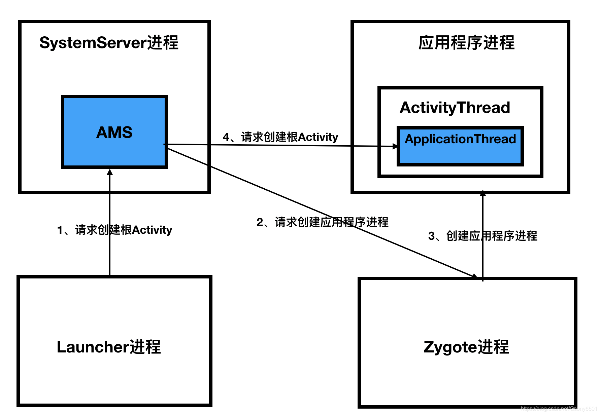

# 简介

Activity 启动分为两种，一个是根 Activity 的启动过程，一个是普通 Activity 的启动过程。区别在 根Activity 启动的时候需要创建应用程序的进程，即相当于应用程序的启动过程。普通 Activity 启动过程就是应用程序内非第一个 Activity 启动，不需要创建应用程序。



如上图所示， 根 Activity 需要经历所有步骤。而普通的 Activity 只需要尽力1,4 步骤。通过 Zygote进程创建应用程序进程的步骤不需要了.

# 1.Launcher 请求 AMS

 

```java
/**
 * 桌面点击事件处理
 *
 * @param v 被点击的快捷方式。即应用图标，文件夹，指示器等
 */
public void onClick(View v) {
    .....
    Object tag = v.getTag();
    if (tag instanceof ShortcutInfo) {
        // 点击了app应用图标
        onClickAppShortcut(v);
    } 
    ......    
}


    /**
     * 处理应用图标点击事件
     *
     * @param v 被点击的图标. 这个图标的tag必须是 {@link ShortcutInfo}.
     */
    protected void onClickAppShortcut(final View v) {
        ......
        // 启动Activity
        startAppShortcutOrInfoActivity(v);
    }

    private void startAppShortcutOrInfoActivity(View v) {
        ItemInfo item = (ItemInfo) v.getTag();
        Intent intent;
        if (item instanceof PromiseAppInfo) {
            PromiseAppInfo promiseAppInfo = (PromiseAppInfo) item;
            intent = promiseAppInfo.getMarketIntent();
        } else {
            intent = item.getIntent();
        }
        if (intent == null) {
            throw new IllegalArgumentException("Input must have a valid intent");
        }
        // 启动 Activity
        boolean success = startActivitySafely(v, intent, item);
        ......
    }

    public boolean startActivitySafely(View v, Intent intent, ItemInfo item) {
        ......

        // 设置intent
        intent.addFlags(Intent.FLAG_ACTIVITY_NEW_TASK);
        if (v != null) {
            intent.setSourceBounds(getViewBounds(v));
        }
        try {
            if (Utilities.ATLEAST_MARSHMALLOW
                    && (item instanceof ShortcutInfo)
                    && (item.itemType == Favorites.ITEM_TYPE_SHORTCUT
                    || item.itemType == Favorites.ITEM_TYPE_DEEP_SHORTCUT)
                    && !((ShortcutInfo) item).isPromise()) {
                // 历史遗留原因，shortcut 需要一些特殊检查
                startShortcutIntentSafely(intent, optsBundle, item);
            } else if (user == null || user.equals(Process.myUserHandle())) {
                // 启动 activity
                startActivity(intent, optsBundle);
            } else {
                LauncherAppsCompat.getInstance(this).startActivityForProfile(
                        intent.getComponent(), user, intent.getSourceBounds(), optsBundle);
            }
            return true;
        } catch (ActivityNotFoundException|SecurityException e) {
            Toast.makeText(this, R.string.activity_not_found, Toast.LENGTH_SHORT).show();
            Log.e(TAG, "Unable to launch. tag=" + item + " intent=" + intent, e);
        }
        return false;
    }
```

可以看到，从应用图标点击，依次经历了 onClick -》onClickAppShortcut -》startAppShortcutOrInfoActivity-》startActivitySafely 这些方法，其实就是一步步的判断传递，最中调用了 Activity#startActivity 方法。 

Activity#startActivity 也是一步步的传递调用，最后调用了 startActivityForResult 方法：

```java
public void startActivityForResult(@RequiresPermission Intent intent, int requestCode,
                                   @Nullable Bundle options) {
    // 如果是从launcher 点击应用图标首次启动Activity，mParent肯定为null
    if (mParent == null) {
        options = transferSpringboardActivityOptions(options);
        Instrumentation.ActivityResult ar =
                mInstrumentation.execStartActivity(
                        this, mMainThread.getApplicationThread(), mToken, this,
                        intent, requestCode, options);
        if (ar != null) {
            mMainThread.sendActivityResult(
                    mToken, mEmbeddedID, requestCode, ar.getResultCode(),
                    ar.getResultData());
        }
        if (requestCode >= 0) {
            mStartedActivity = true;
        }

        cancelInputsAndStartExitTransition(options);
    } else {
        ......
    }
}
```

接着转到了 Instrumentation#execStartActivity 中：

```java
public ActivityResult execStartActivity(
        Context who, IBinder contextThread, IBinder token, Activity target,
        Intent intent, int requestCode, Bundle options) {
    ......
    try {
        intent.migrateExtraStreamToClipData();
        intent.prepareToLeaveProcess(who);
        // 获取AMS代理对象，并调用 startActivity 方法
        int result = ActivityManager.getService()
                .startActivity(whoThread, who.getBasePackageName(), intent,
                        intent.resolveTypeIfNeeded(who.getContentResolver()),
                        token, target != null ? target.mEmbeddedID : null,
                        requestCode, 0, null, options);
        checkStartActivityResult(result, intent);
    } catch (RemoteException e) {
        throw new RuntimeException("Failure from system", e);
    }
    return null;
}
```

ActivityManager.getService() 是通过 AIDL 获取到了 AMS 的代理对象

```java
public static IActivityManager getService() {
    return IActivityManagerSingleton.get();
}

private static final Singleton<IActivityManager> IActivityManagerSingleton =
        new Singleton<IActivityManager>() {
            @Override
            protected IActivityManager create() {
                final IBinder b = ServiceManager.getService(Context.ACTIVITY_SERVICE);
                final IActivityManager am = IActivityManager.Stub.asInterface(b);
                return am;
            }
        };
```

很明显，就是 AIDL 的写法，对应的 AIDL 文件是：IActivityManager.aidl

其实以上步骤，就是在 Launcher 中处理点击事件，然后一步步传递，把启动 Activity 交给 AMS 去处理。

# 2. AMS 到 ApplicationThread

从 Launcher 过来，首先被调用到的方法就是 AMS#startActivity

```java
@Override
public final int startActivity(IApplicationThread caller, String callingPackage,
        Intent intent, String resolvedType, IBinder resultTo, String resultWho, int requestCode,
        int startFlags, ProfilerInfo profilerInfo, Bundle bOptions) {
    // UserHandle.getCallingUserId()获取到了调用者的uid，AMS 根据 uid 确定调用者权限
    return startActivityAsUser(caller, callingPackage, intent, resolvedType, resultTo,
            resultWho, requestCode, startFlags, profilerInfo, bOptions,
            UserHandle.getCallingUserId());
}

    @Override
    public final int startActivityAsUser(IApplicationThread caller, String callingPackage,
            Intent intent, String resolvedType, IBinder resultTo, String resultWho, int requestCode,
            int startFlags, ProfilerInfo profilerInfo, Bundle bOptions, int userId) {
        // 判断调用者进程是否已被隔离
        enforceNotIsolatedCaller("startActivity");
        // 检查调用者权限
        userId = mUserController.handleIncomingUser(Binder.getCallingPid(), Binder.getCallingUid(),
                userId, false, ALLOW_FULL_ONLY, "startActivity", null);
        return mActivityStarter.startActivityMayWait(caller, -1, callingPackage, intent,
                resolvedType, null, null, resultTo, resultWho, requestCode, startFlags,
                profilerInfo, null, null, bOptions, false, userId, null, "startActivityAsUser");
    }
```

只会依次调用了 ActivityStarter#startActivityMayWait -》 startActivityLocked -》startActivity -》startActivity -》startActivityUnchecked

```java
/**
 * 该方法主要处理与栈相关的内容
 */
private int startActivityUnchecked(......) {
    ......
    
    boolean newTask = false;
    final TaskRecord taskToAffiliate = (mLaunchTaskBehind && mSourceRecord != null)
            ? mSourceRecord.getTask() : null;
    int result = START_SUCCESS;
    // 根Activity 的task一定是 FLAG_ACTIVITY_NEW_TASK，这里判断条件可以通过
    if (mStartActivity.resultTo == null && mInTask == null && !mAddingToTask
            && (mLaunchFlags & FLAG_ACTIVITY_NEW_TASK) != 0) {
        newTask = true;
        // 创建一个新的 TaskRecord
        result = setTaskFromReuseOrCreateNewTask(
                taskToAffiliate, preferredLaunchStackId, topStack);
    } else ......
    ......
    if (mDoResume) {
        final ActivityRecord topTaskActivity =
                mStartActivity.getTask().topRunningActivityLocked();
        if (!mTargetStack.isFocusable()
                || (topTaskActivity != null && topTaskActivity.mTaskOverlay
                && mStartActivity != topTaskActivity)) {
            mTargetStack.ensureActivitiesVisibleLocked(null, 0, !PRESERVE_WINDOWS);
            mWindowManager.executeAppTransition();
        } else {
            if (mTargetStack.isFocusable() && !mSupervisor.isFocusedStack(mTargetStack)) {
                mTargetStack.moveToFront("startActivityUnchecked");
            }
            // 调用 ActivityStackSupervisor 创建 Activity
            mSupervisor.resumeFocusedStackTopActivityLocked(mTargetStack, mStartActivity,
                    mOptions);
        }
    } else {
        mTargetStack.addRecentActivityLocked(mStartActivity);
    }
    ......

    return START_SUCCESS;
}
```

ActivityStackSupervisor#resumeFocusedStackTopActivityLocked -> ActivityStack#resumeTopActivityUncheckedLocked -> resumeTopActivityInnerLocked -> ActivityStackSupervisor#startSpecificActivityLocked , 按照这个顺序一次调用下来：

```java
void startSpecificActivityLocked(ActivityRecord r,
                                 boolean andResume, boolean checkConfig) {
    // 获得即将启动的Activity所在进程
    ProcessRecord app = mService.getProcessRecordLocked(r.processName,
            r.info.applicationInfo.uid, true);

    r.getStack().setLaunchTime(r);

    // 即将启动的Activity所在进程已经存在并且启动
    if (app != null && app.thread != null) {
        try {
            if ((r.info.flags&ActivityInfo.FLAG_MULTIPROCESS) == 0
                    || !"android".equals(r.info.packageName)) {
                app.addPackage(r.info.packageName, r.info.applicationInfo.versionCode,
                        mService.mProcessStats);
            }
            // 启动Activity
            realStartActivityLocked(r, app, andResume, checkConfig);
            return;
        } catch (RemoteException e) {
            Slog.w(TAG, "Exception when starting activity "
                    + r.intent.getComponent().flattenToShortString(), e);
        }
    }

    mService.startProcessLocked(r.processName, r.info.applicationInfo, true, 0,
            "activity", r.intent.getComponent(), false, false, true);
}


    /**
     * 该方法通过 AIDL通信，从AMS进程到ApplicationThread
     */
    final boolean realStartActivityLocked(ActivityRecord r, ProcessRecord app,
                                          boolean andResume, boolean checkConfig) throws RemoteException {

        ......
                // 进入到ApplicationThread中
                app.thread.scheduleLaunchActivity(new Intent(r.intent), r.appToken,
                        System.identityHashCode(r), r.info,
                        // TODO: Have this take the merged configuration instead of separate global
                        // and override configs.
                        mergedConfiguration.getGlobalConfiguration(),
                        mergedConfiguration.getOverrideConfiguration(), r.compat,
                        r.launchedFromPackage, task.voiceInteractor, app.repProcState, r.icicle,
                        r.persistentState, results, newIntents, !andResume,
                        mService.isNextTransitionForward(), profilerInfo);
        ......
        return true;
    }
```

# 3.ActivityThread 启动 Activity 过程

scheduleLaunchActivity 方法中，会将传入的参数封装成 ActivityClientRecord，然后通过 handler 发送一个消息。

handler 接受到消息后，调用 handleLaunchActivity 方法：

```java
private void handleLaunchActivity(ActivityClientRecord r, Intent customIntent, String reason) {
    ......
    Activity a = performLaunchActivity(r, customIntent);

    if (a != null) {
        r.createdConfig = new Configuration(mConfiguration);
        reportSizeConfigurations(r);
        Bundle oldState = r.state;
        // 将Activity状态置为Resume
        handleResumeActivity(r.token, false, r.isForward,
                !r.activity.mFinished && !r.startsNotResumed, r.lastProcessedSeq, reason);
        ......
    } else {
        ......
    }
}  
```

首先是调用 performLaunchActivity 创建一个 Activity 对象：

```java
private Activity performLaunchActivity(ActivityClientRecord r, Intent customIntent) {
    // 获取 ActivityInfo 类
    ActivityInfo aInfo = r.activityInfo;
    if (r.packageInfo == null) {
        // 获取 APK 文件描述信息
        r.packageInfo = getPackageInfo(aInfo.applicationInfo, r.compatInfo,
                Context.CONTEXT_INCLUDE_CODE);
    }

    ComponentName component = r.intent.getComponent();
    if (component == null) {
        component = r.intent.resolveActivity(
                mInitialApplication.getPackageManager());
        r.intent.setComponent(component);
    }

    if (r.activityInfo.targetActivity != null) {
        component = new ComponentName(r.activityInfo.packageName,
                r.activityInfo.targetActivity);
    }

    // 创建要启动的Activity 的上下文对象
    ContextImpl appContext = createBaseContextForActivity(r);
    Activity activity = null;
    try {
        // 通过类加载器，创建Activity的实例
        java.lang.ClassLoader cl = appContext.getClassLoader();
        activity = mInstrumentation.newActivity(
                cl, component.getClassName(), r.intent);
        StrictMode.incrementExpectedActivityCount(activity.getClass());
        r.intent.setExtrasClassLoader(cl);
        r.intent.prepareToEnterProcess();
        if (r.state != null) {
            r.state.setClassLoader(cl);
        }
    } catch (Exception e) {
        if (!mInstrumentation.onException(activity, e)) {
            throw new RuntimeException(
                    "Unable to instantiate activity " + component
                            + ": " + e.toString(), e);
        }
    }

    try {
        // 创建 Application 对象,并调用他的 onCreate 方法
        Application app = r.packageInfo.makeApplication(false, mInstrumentation);

        if (localLOGV) Slog.v(TAG, "Performing launch of " + r);
        if (localLOGV) Slog.v(
                TAG, r + ": app=" + app
                        + ", appName=" + app.getPackageName()
                        + ", pkg=" + r.packageInfo.getPackageName()
                        + ", comp=" + r.intent.getComponent().toShortString()
                        + ", dir=" + r.packageInfo.getAppDir());

        if (activity != null) {
            ......
            appContext.setOuterContext(activity);
            // 初始化 Activity.即调用attach 方法
            activity.attach(appContext, this, getInstrumentation(), r.token,
                    r.ident, app, r.intent, r.activityInfo, title, r.parent,
                    r.embeddedID, r.lastNonConfigurationInstances, config,
                    r.referrer, r.voiceInteractor, window, r.configCallback);
            ......

            activity.mCalled = false;
            // 调用 Activity#onCreate 方法
            if (r.isPersistable()) {
                mInstrumentation.callActivityOnCreate(activity, r.state, r.persistentState);
            } else {
                mInstrumentation.callActivityOnCreate(activity, r.state);
            }
            ......
        }
        r.paused = true;

        mActivities.put(r.token, r);
    } catch (Exception e) {
        ......
    }
    return activity;
}
```

在改方法中，会先创建 Activity 对象，然后创建 Application 对象，再一次调用 Activity 的 attach ，onCreate 方法。

ActivityThread#performLaunchActivity 方法调用完成后，会接着调用 handleResumeActivity ，处理被创建的 Actvity。