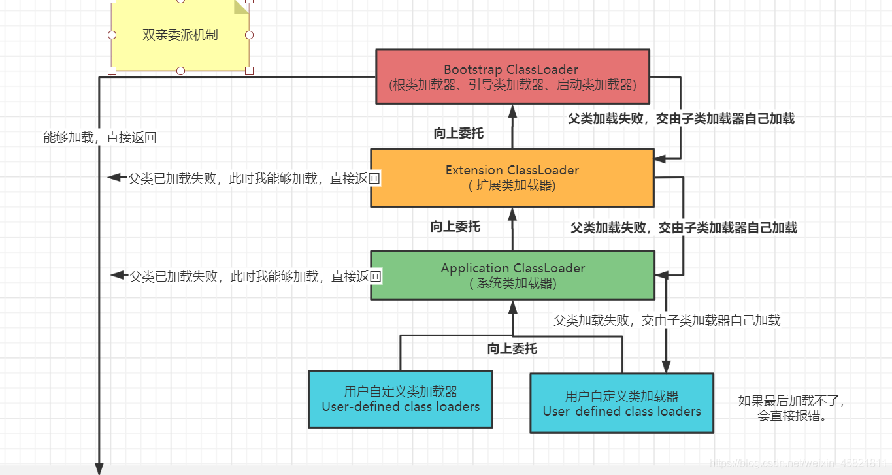
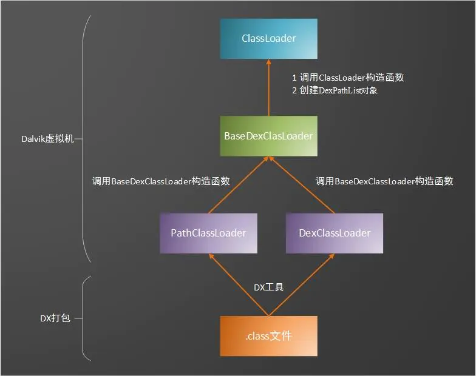

[TOC]

# 1 JAVA 类加载机制

## 1.1 类加载时机

- 隐式加载 new 创建类的实例,
- 显式加载：loaderClass,forName等
- 访问类的静态变量，或者为静态变量赋值
- 调用类的静态方法
- 使用反射方式创建某个类或者接口对象的Class对象。
- 初始化某个类的子类
- 直接使用`java.exe`命令来运行某个主类

## 1.2 类加载过程

java 编译器将 java 文件编译成  .class 文件,  .class文件保存着 java 转换后，虚拟机将要执行的指令。当需要某个类的时候，java虚拟机会加载 .class 文件，并创建对应的class对象，将class文件加载到虚拟机的内存，这个过程被称为类的加载。类的加载过程分为5个步骤

- 加载
- 验证
- 准备
- 解析
- 初始化

方便记忆就是“家宴准备了西式菜”

## 1.3 java中的类加载器

java中一般有四种类加载器

- 引导类加载器
- 扩展类加载器
- 应用程序加载器
- 自定义加载器

### 引导类加载器

即Bootstrap ClassLoader，内部是C++代码实现的，用于加载制定JDK的核心类库。他加载的类都是在 jre/lib  目录下，或者是 -Xbootclasspath 参数指定的目录。

### 扩展类加载器

即 Extensions ClassLoader。java 中的实现类为 ExtClassLoader。用于加载java 的扩展类，一般是都 jre/lib/ext 目录下的类。

### 应用程序加载器

即Application ClassLoader。 java 中实现为 AppClassLoader。它又被称为系统类加载器。用于加载当前程序的ClassPath 目录和系统属性 java.class.path 指定的目录。

### 自定义加载器

即通过继承 ClassLoader 类的方式来实现自己的类的加载器。需要实现 findClass 方法并在该方法中调用 defineClass 方法。

```java
public class CustomClassLoader extends ClassLoader {

    // 指定加载类的目录
    private String mPath;

    public CustomClassLoader(String path) {
        mPath = path;
    }

    @Override
    protected Class<?> findClass(String className) throws ClassNotFoundException {
        byte[] classData = loadClassData(className);
        if (classData == null) {
            throw new ClassNotFoundException();
        }
        return defineClass(className, classData, 0, classData.length);
    }

    /**
     * 根据类名称，找到类的文件，读取文件中内容
     */
    private byte[] loadClassData(String className) {
        File file = new File(mPath, getFileName(className));
        try {
            ByteArrayOutputStream os = new ByteArrayOutputStream();
            FileInputStream is = new FileInputStream(file);
            byte[] buffer = new byte[1024];
            int len = 0;
            while ((len = is.read(buffer)) != -1) {
                os.write(buffer, 0, len);
            }
            return os.toByteArray();
        } catch (Exception e) {
            e.printStackTrace();
        }
        return null;
    }

    /**
     * 根据类名获取到类文件名称
     *
     * @param name 可能是单独的类的名称，也可能是包括包名的类名称。比如 xxx.xxx.xxx
     */
    private String getFileName(String name) {
        int i = name.lastIndexOf(".");
        if (i == -1) {
            return name + ".class";
        }
        return name.substring(i + 1) + ".class";
    }
}
```

如上所示，自定义了一个类加载器。在本地桌面写一个Test2.java文件，然后通过 javac ，编译成 class 文件。然后通过自定义的类加载器调用Test2：

```java
public class Test {

    public static void main(String[] args) throws Exception {
        CustomClassLoader loader = new CustomClassLoader("/home/huang/Desktop");
        Class<?> clazz = loader.loadClass("Test2");
        if (clazz!=null){
            Object obj = clazz.newInstance();
            System.out.println("obj: "+obj);
        }
    }
}
```

如上所示，最终可以成功输出 Test2的类名

## 1.4 双亲委派机制

当某个类加载器需要加载某个`.class`文件时，它首先把这个任务委托给他的上级类加载器，递归这个操作，如果上级的类加载器没有加载，自己才会去加载这个类。

该机制作用：

- 重复加载同一个`.class`。通过委托去向上面问一问，加载过了，就不用再加载一遍。保证数据安全。
- 保证核心`.class`不能被篡改。通过委托方式，不会去篡改核心`.clas`，即使篡改也不会去加载，即使加载也不会是同一个`.class`对象了。不同的加载器加载同一个`.class`也不是同一个`Class`对象。这样保证了`Class`执行安全。

双亲委派机制流程图如下所示：



ClassLoader 是 AppClassLoader 和 ExtClassLoader 的最顶层父类，他的 loadClass 方法如下：

```java
 protected Class<?> loadClass(String name, boolean resolve) throws ClassNotFoundException{
            Class<?> c = findLoadedClass(name);  // 1
            if (c == null) {
                try {
                    if (parent != null) {
                        c = parent.loadClass(name, false); // 2
                    } else {
                        c = findBootstrapClassOrNull(name); // 3
                    }
                } catch (ClassNotFoundException e) {
                    // ClassNotFoundException thrown if class not found  from the non-null parent class loader
                }

                if (c == null) {
                    c = findClass(name); // 4
                }
            }
            return c;
    }
```

如上所示

注释 1：调用  findLoadedClass 找到类，传入的参数就是类的名称，其内部调用的是 native 方法。如果找到了这个类，就说明这个类已经加载过了，不需要再加载。

注释 2 ：如果上层加载器不为null ，就交给上层加载器去处理。

注释3 ：如果上层加载器为null，就交给引导加载器去处理。

注释4： 如果所有的上层加载器都无法加载，就交给自己去处理。

注释2 ，注释3 ，综合起来就是交给上层加载器去处理，因为 引导类加载器是 c++ 语言实现的，所以这里拆分开来。

以上就是整个双亲委派机制的实现。 最后异步的 findClass 方法由具体的类加载器去实现。

# 2 Android 类加载器

Android 中的类加载机制与java的略有不同。Jvm通过ClassLoader加载的class字节码，而android中 Dalvik/ART 虚拟机通过ClassLoader加载则是dex。

android 的类加载器主要有三种：

-  BootClassLoader
- DexClassLoader
- PathClassLoader

其中，DexClassLoader 和 PathClassLoader 都是继承BaseDexClassLoader的。



加载流程如上所示，也是符合java 的双亲委派机制的。

## 2.1 BootClassLoader

系统启动的时候会使用 BootClassLoader 来预加载常用类，该类是用java代码实现的。

他继承自 ClassLoader，是一个单例，访问修饰符是默认的，我们在应用程序中无法访问。

## 2.2 DexClassLoader

可以加载 dex 文件以及包含 dex 文件的压缩文件（比如jar 包，apk文件），最终加载的都是 dex 文件。

这个类加载器需要一个属于应用的私有的，可以使用目录作为它自己的缓存优化目录。这个目录一般在 data/data/<package name>/... 目录下。

最好不要使用外部目录，因为容易遭受代码注入的攻击。

## 2.3 PathClassLoader

PathClassLoader被用来加载本地文件系统上的文件或目录，但不能从网络上加载。即支持加载 dex 或者已经安装的 APK（因为存在缓存的dex）。

他构造方法的第二个参数一定为 data/dalvik-cache 目录。已经安装的 apk 的 dex 文件会存储到这个目录下面。

## 2.4 ClassLoader 的继承关系

DexClassLoader 和 PathClassLoader 都是继承 BaseDexClassLoader.