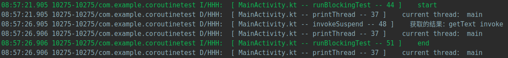
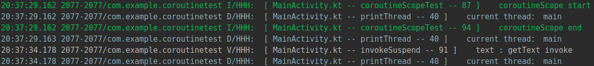
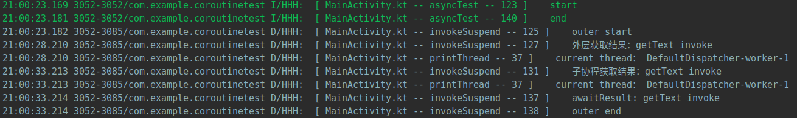
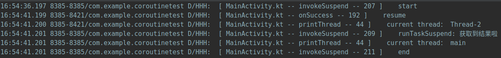

[TOC]


# 简介

在 kotlin 语言中，协程其实可以理解为就是一个线程框架。

Coroutine是编译器级的，Process和Thread是操作系统级的。

一个线程可以有多个协程，但是同一时刻只有一个协程被执行。协程的切换是不涉及线程的上下文切换以及线程状态改变的。

总结下，协程是跑在线程上的，一个线程可以同时跑多个协程，每一个协程则代表一个耗时任务，我们手动控制多个协程之间的运行、切换，决定谁什么时候挂起，什么时候运行，什么时候唤醒，而不是 Thread 那样交给系统内核来操作去竞争 CPU 时间片。

# 1 启动协程

启动协程方式一般有以下几种：

-  runBlocking
- GlobalScope.launch
- CoroutineScope + launch

## 1.1  runBlocking

该方式启动，会阻塞当前线程，直到内部所有的逻辑以及子协程的逻辑全部执行完成。

因为该方法是阻塞的，所以在主线程中慎用，容易造成ANR

```kotlin
    private fun printThread(){
        HLog.d("current thread： ${Thread.currentThread().name}")
    }

    /**
     * 耗时方法，延迟5s后获取一段文字
     */
    private suspend fun getText(): String {
        delay(5000)
        return "getText invoke"
    }

    /**
     * 该方式将阻塞线程
     */
    private fun runBlockingTest() {
        HLog.i("start")
        printThread()
        runBlocking {
            val text = getText()
            HLog.d("获取的结果：$text")
            printThread()
        }
        HLog.i("end")
        printThread()
    }

```

onCreate 方法中调用 runBlockingTest ，打印 log 出来如下：



从上面可以看到，的确是延迟了5s后获取到接口，并且在 runBlocking 代码块后面的 log 也是延迟5s才打印出来的

## 1.2 GlobalScope.launch

该方式启动协程，不会阻塞当前线程。但是该方式启动的协程是全局单例，不推荐。

被启动的协程的生命周期与应用程序一致，慎用。容易造成启动协程的组件生命周期结束并且被销毁，但是该协程还存在。

```kotlin
private fun globalLaunchTest() {
    HLog.i("start")
    printThread()
    GlobalScope.launch {
        val text = getText()
        HLog.d("获取的结果：$text")
        printThread()
    }
    HLog.i("end")
    printThread()
}
```

执行结果如下：


可以看到，该方式启动的协程并不会阻塞当前线程的代码执行。延迟5s后，协程代码块里面的内容是在另一个线程内执行的。

## 1.3  CoroutineScope + launch

推荐使用的方式。

该方式启动的协程不会阻塞线程。

一般可以在自己需要的组件中实现 CoroutineScope 接口，然后在任意地方即可调用 launch 方法启动协程。使用该方式启动的协程与组件的生命周期绑定，从而可以实现安全可靠的协程调用。

```kotlin
private fun coroutineScopeTest() {
    HLog.i("coroutineScope start")
    printThread()
    CoroutineScope(Dispatchers.Main).launch {
        val text = getText()
        HLog.v("text : $text")
        printThread()
    }
    HLog.i("coroutineScope end")
    printThread()
}
```

执行结果如下：



# 2 启动子协程

在一个协程中，启动一个子协程的方式有两种

- launch
- async

## 2.1 launch方式启动

异步启动一个子协程，返回值是 Job 。该方法启动的协程是非阻塞式的。

## 2.2 aysnc

异步启动一个子协程，该方式会返回一个 Deffered 对象，可以通过 Deffered#await 方法等待该子协程执行完毕并获取结果，常常用于并发执行同步等待的情况

```kotlin
private fun asyncTest() {
    HLog.i("start")
    GlobalScope.launch {
        HLog.d("outer start")
        val outerText = getText()
        HLog.d("外层获取结果：$outerText")
        printThread()
        val deferred = async {
            val text = getText()
            HLog.d("子协程获取结果：$text")
            printThread()
            // 最后一行是返回值
            text
        }
        val awaitResult = deferred.await()
        HLog.d("awaitResult: $awaitResult")
        HLog.d("outer end")
    }
    HLog.i("end")
}
```

执行结果如下：



可以看到，如果使用的 async 方式创建的子协程，会阻塞当前的外部协程，直到子协程完事。但是是否会阻塞线程，就得看外部协程是否是阻塞式的。

# 3 取消协程

launch 方式启动，返回的是 Job 对象。

async 方式启动，返回值是 Deffered 对象，它实现了 job 接口。

job 接口中，cancel 方法就是用于取消协程的。

# 4 调度器

 调度器  ，控制协程以任何策略分配到哪些线程上运行。默认的工具类 Dispatchers 实现了四种调度器具。

- Default

  默认调度器。如果不添加任何调度器，就是这个。

  协程会在线程池中运行。

- IO

  基于 Default 调度器背后的线程池，并实现了独立的队列和限制，因此协程调度器从 Default 切换到 IO 并不会触发线程切换。

  协程在线程池中运行。

- Main

  限制所有的执行都在主线程

- Unconfined

  直接执行。协程挂起恢复后，在哪个线程完全由所调用的挂起函数决定。

# 5 挂起

## 5.1 suspend关键字

用来修饰一个方法，实际上该关键字的作用就是标记一个函数是耗时的函数，函数里面需要涉及到协程切换。

如果该函数内部没有耗时逻辑处理，就不需要用改方法标记。

suspend 方法就应该在所有任务都完成后再返回。如果在 suspend 方法内部有需要并发执行的内容，那就应该等待他们都完成后再返回，此时可以使用 coroutineScope ，而不是在方法签名上加上 CoroutineScope 扩展。

## 5.2 挂起函数

挂起函数挂起协程，但是不会阻塞协程所在的线程。

挂起函数就是协程的一个分水岭。挂起函数前后的代码都是在指定的线程中执行，而挂起函数可以在另一个指定的线程中执行。

挂起函数不会启动协程，但是可能导致协程切换。

 常用的挂起函数有：

- withContext
- delay
- yield

# 6 封装异步回调

封装异步回调的方式有两种

- suspendCoroutine
- suspendCancellableCoroutine

上面两个作用一样，唯一区别就是 suspendCancellableCoroutine 可以通过cancel 方法取消协程执行，而 suspendCoroutine 是不可以取消的。所以尽量使用 suspendCancellableCoroutine 。

在获取回调结果会，一般使用  CancellableContinuation 的 resume， resumeWith， resumeWithException 方法把结果包装。

```kotlin
    interface Callback {

        fun onSuccess(msg: String)

        fun onFail(e: Exception)
    }

    private fun getTextFromNet(callback: Callback) {
        thread {
            Thread.sleep(5000)
            callback.onSuccess("获取到结果啦")
        }
    }

    private suspend fun runTask(): String {
        return suspendCancellableCoroutine<String> {
            getTextFromNet(object : Callback {
                override fun onSuccess(msg: String) {
                    HLog.d("resume")
                    printThread()
                    it.resume(msg)
                }

                override fun onFail(e: Exception) {
                    it.resumeWithException(e)
                }
            })
        }
    }

    private fun suspendCancellableCoroutineTest() {
        CoroutineScope(Dispatchers.Main).launch {
            HLog.d("start")
            val task = runTask()
            HLog.d("runTaskSuspend: $task")
            printThread()
            HLog.d("end")
        }
    }
```

如上所示，getTextFromNet 是一个耗时任务，执行完毕后通过 Callback 回调。 runTask 使用 suspendCancellableCoroutine 改造，将异步会掉改为同步的方式。执行结果如下：



