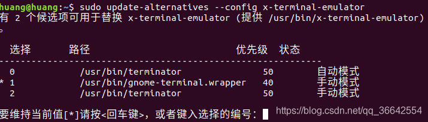

[TOC]

# 1 重要目录

在Ubuntu中，一般有三个安装目录:

-  /usr

  系统级别目录，可以理解为windows中 C:/Windows 目录。其中 /usr/lib 可以理解为 C:/Windows/System32，存放所有可执行文件的库文件。这个目录下通常都是系统发行时自带的程序。

- /usr/local

  用户的程序目录，可以理解为 C:/Program Files 。 用户自己编译的软件默认会安装到这个目录下

- /opt

  用户的程序目录，opt 就是optional 缩写，可选项。一般情况下，安装一些大型的第三方软件都放在这个地方。可以理解为windows中的 D盘中自定义的安装目录。如果不需要里面的东西，可以直接 rm -rf 删除掉

以上仅仅是程序的目录，源码存放目录有两个：

- /usr/src 

  系统级的源码目录

- /usr/local/src

   用户级的源码目录

其他重要目录：

- /usr/share 

  各种程序间的共享文件，如字体，图标，文档等

- /usr/local/share

   同上，只是这个针对的程序是 /usr/local目录下的
  /usr/share/applications ， ubuntu有的时候不会自动创建图标，所以得自己制作启动图标，启动图标都是放在这个目录下的

# 2 配置文件

“/bin”、“/sbin”、“/usr/bin”、“/usr/sbin”、“/usr/local/bin”等路径已经在系统环境变量中了，如果可执行文件在这几个标准位置，在终端命令行输入该软件可执行文件的文件名和参数(如果需要参数)，回车即可。

使用 export 或者 echo $PATH 查看定义的环境变量，配置环境变量的文件 /etc/profile 和 .bashrc 文件

ubuntu一般有五个配置文件：

- /etc/environment
  设置整个系统的环境变量。查看一下该文件，就可以看到那些路径已经在系统的环境变量中了。
- /etc/profile
  为所有的用户都添加环境信息。当用户第一次登录时，该文件被执行，并从/etc/profile.d目录下搜集 shell 的所有设置。如果该文件修改了，必须重新启动才会生效。
- /etc/bash或者/etc/bash.bashrc
  为每个运行 bash shell的用户执行次文件，配置bash 信息，不需要重启，直接重新打开一个bash就生效。
- ~/.profile
  只为当前用户添加环境信息。相当于/etc/profile的私人版本。
- ~/.bashrc
  只作用于当前用户。相当于/etc/bash或者/etc/bash.bashrc的私人版本。

登录时，配置文件读取的顺序依次是： /etc/environment /etc/profile ~/.profile
一般情况下，我们只会使用到两个配置文件，即　/etc/profile 和　~/.profile

对配置文件修改，最好直接重启一下。也可以通过source命令立即让修改生效。
示例：　 source /etc/profile　就可以让文件立即生效

# 3 安装软件

总共有三种安装方式

- apt-get 方法
- dpkg 安装deb包
- make install 源代码安装

参考链接：　https://www.cnblogs.com/xwdreamer/p/3623454.html

# 4 卸载软件

卸载方式一般有三种

- 使用自带的应用软件中心或者使用Synaptic卸载

- apt卸载

- dpkg卸载

 如何知道卸载的软件包的相关信息
 查找具体的包名称(当然，有的时候不一定能够查找得到)
 dpkg --get-selections | grep -i “软件相关名称”
 dpkg --list | grep -i “软件相关名称”

列出与包相关联的文件
dpkg -L

##  4.1 apt 卸载

删除安装包以及配置文件：
apt-get purge 或者 apt-get --purge remove

删除为了满足依赖而安装的，但现在不再需要的软件包（包括已安装包），保留配置文件 ：
apt-get autoremove

删除 /var/cache/apt/archives/下的deb包。一定要加名称，如果不加名称，会那个目录下所有的都被清理了
apt-get clean

## 4.2 dpkg卸载

卸载安装好的软件包，配置文件保留：
dpkg -r

彻底卸载软件包与配置文件
dpkg -P

卸载完成之后可以到 /var/lib/dpkg/status查看状态，rc表示 remove ok config-files ,当然，不需要通过cat命令查看整个文件，只需要通过一下命令查看即可：
dpkg --status

## 4.3 综合命令删除

1. 删除安装包以及配置
   apt-get purge 或者 apt-get --purge remove
2. 删除不需要的依赖，但是保留了配置文件
   apt-get autoremove
3. 清除残留数据
   dpkg -l |grep ^rc|awk ‘{print $2}’ |sudo xargs dpkg -P
4. 删除 /var/cache/apt/archives/下的deb包。一定要加名称，如果不加名称，会那个目录下所有的都被清理了
   apt-get clean

# 5 具体软件安装

## 5.1 terminal

按步骤执行下面命令：
sudo add-apt-repository ppa:gnome-terminator
sudo apt-get update
sudo apt-get install terminator
安装完成后，修改默认快捷键启动的终端为Terminator,执行下面命令
sudo update-alternatives --config x-terminal-emulator
如下图所示，我的terminator安装目录在/usr/bin/terminator目录下，在图中显示的是0，当前按快捷键启动的默认是1，所以直接输入0即可。



觉得颜色太丑，所以更改一下，上面接好了五个配置文件，这里只需要选择一个，我选择在.bashrc文件下添加下面一行即可：

```bash
// 直接在最后一行追加即可，其他内容不要改变
PS1='${debian_chroot:+($debian_chroot)}\[\033[01;35;40m\]\u\[\033[00;00;40m\]@\[\033[01;35;40m\]\h\[\033[00;31;40m\]:\[\033[00;00;40m\]\w \[\033[01;32;40m\]\$ \[\033[01;37;40m\]'
```

添加完成后保存，重新打开终端就可以生效。
上面仅仅是改变了颜色。但是可以通过下面的方法直接修改终端的颜色以及默认大小，字体等等。

```bash
1.打开config配置文件
vim ~/.config/terminator/config

2. 在[window0] 下面添加如下内容，然后保存即可
size = 1000,700

最终我的配置文件内容如下（其中颜色palette那一行代表颜色，也可以通过更改这里达到更改终端颜色的）：
[global_config]
  focus = system
  handle_size = 1
  suppress_multiple_term_dialog = True
  title_receive_bg_color = "#00c9b2"
  title_transmit_bg_color = "#d30102"
[keybindings]
  close_term = <Primary>w
  close_window = <Primary><Shift>w
[layouts]
  [[default]]
    [[[child1]]]
      parent = window0
      profile = default
      type = Terminal
    [[[window0]]]
      parent = ""
      type = Window
      size = 1000,700
[plugins]
[profiles]
  [[default]]
    background_color = "#0b0909"
    background_darkness = 0.7
    background_image = /home/huang/桌面/下载.jpeg
    cursor_color = "#ead929"
    font = Ubuntu Mono 13
    foreground_color = "#16bf06"
    palette = "#000000:#aa0000:#00aa00:#aa5500:#99ff00:#aa00aa:#00aaaa:#aaaaaa:#555555:#ff5555:#55ff55:#ffff55:#5555ff:#ff55ff:#55ffff:#ffffff"
    scroll_background = False
    use_system_font = False
    visible_bell = True
```

## 5.2 chrome

```bash
sudo wget http://www.linuxidc.com/files/repo/google-chrome.list -P /etc/apt/sources.list.d/

// 导入谷歌软件的公钥，用于下面步骤中对下载软件进行验证，如果顺利的话，命令将返回“OK”。注意，最后的横线处不要有多余的空格
wget -q -O - https://dl.google.com/linux/linux_signing_key.pub  | sudo apt-key add -　

//用于对当前系统的可用更新列表进行更新。这也是许多 Linux 发行版经常需要执行的操作，目的是随时获得最新的软件版本信息。
sudo apt-get update

//执行对谷歌 Chrome 浏览器（稳定版）的安装。
sudo apt-get install google-chrome-stable

//最后，如果一切顺利，在终端中执行以下命令,将会启动谷歌 Chrome 浏览器，它的图标将会出现在屏幕左侧的 Launcher 上，在图标上右键——“锁定到启动器”，以后就可以简单地单击启动了。
/usr/bin/google-chrome-stabl

```

或者到 https://www.google.com/chrome/?&brand=CHWL&utm_campaign=en&utm_source=en-et-na-us-chrome-bubble&utm_medium=et,
然后下载deb包,执行
sudo dpkg -i ‘google-chrome-stable_current_amd64.deb’

但是,此时有可能是外部链接适应chrome打开的始终是一个空白页,所以需要配置一下:

```bash
// 进入到以下目录
cd .local/share/applications/
// 2. 重写google-chrome.desktop文件,其他内容不变,仅仅改变下面这一行.注意,只要在最后面加上 %U即可,要添加前面的空格哦
Exec=/usr/bin/google-chrome-stable %U
```

## 5.3 sublime

官网下载：http://www.sublimetext.com/
下载后得到安装包，然后解压：
tar -xvf ‘/home/huang/桌面/sublime_text_3_build_3211_x64.tar.bz2’
解压完成后，有个sublime_text.desktop文件，把这个文件拿到桌面上。
然后把整个sublime_text_3文件移入到/opt目录下
sudo mv ‘/home/huang/桌面/sublime_text_3’ /opt/
移动完成后，终端切到/opt目录下,查看sublime是否能够打开
./sublime_text
正常打开后，证明没有问题了。接下来制作启动图标。把桌面上的sublime_text.desktop文件用文本工具打开，然后将里面的路径与图标更换一下，最后结果如下所示：

```bash
[Desktop Entry]
Version=1.0
Type=Application
Name=Sublime Text
GenericName=Text Editor
Comment=Sophisticated text editor for code, markup and prose
Exec=/opt/sublime_text_3/sublime_text %F
Terminal=false
MimeType=text/plain;
Icon=/opt/sublime_text_3/Icon/48x48/sublime-text.png
Categories=TextEditor;Development;
StartupNotify=true
Actions=Window;Document;

[Desktop Action Window]
Name=New Window
Exec=/opt/sublime_text_3/sublime_text -n
OnlyShowIn=Unity;

[Desktop Action Document]
Name=New File
Exec=/opt/sublime_text_3/sublime_text --command new_file
OnlyShowIn=Unity;
```

修改完成之后，如果没法固定到侧边栏，就将该文件复制到 /usr/share/applications 目录下面即可。

## 5.4 open jdk

参考文章：https://ubuntuhandbook.org/index.php/2015/01/install-openjdk-8-ubuntu-14-04-12-04-lts/

```bash
sudo add-apt-repository ppa:openjdk-r/ppa
//更新系统包缓存并安装OpenJDK 8
sudo apt-get update 
sudo apt-get install openjdk-8-jdk
//如果您的系统上安装了多个Java版本。运行下面的命令设置默认的Java.键入一个数字以选择Java版本，可选择设置默认的java版本
sudo update-alternatives --config java
// 并通过运行以下命令设置默认Java编译器：
sudo update-alternatives --config javac 
//验证是否安装成功,如果显示版本，成功
java -version
//配置环境变量.这一步一定要配置哈。要在 etc/profile 文件下配置
//配置信息如下所示，JAVA_HOME地址就是jdk安装目录：
export JAVA_HOME=/usr/lib/jvm/java-1.8.0-openjdk-amd64
export JRE_HOME=${JAVA_HOME}/jre  
export CLASSPATH=.:${JAVA_HOME}/lib:${JRE_HOME}/lib  
export PATH=${JAVA_HOME}/bin:$PATH
//保存后，关闭文本，回到终端输入执行
source /etc/profile 
```

