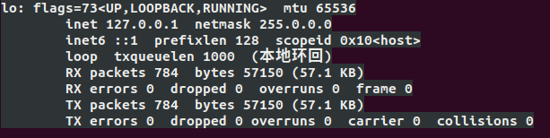
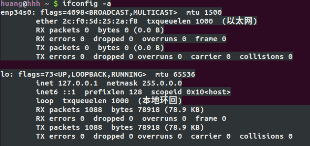

# 联网问题

## 1 手动配置联网

表现为Ubuntu开机无法自动联网，而且在 设置 -》网络  中没有有线连接者个选项

首先，ifconfig 查看启动的网卡，发现尽然没了 eth0 ，只有一个 lo了，如下所示：



那就 ifconfig  -a 看下所有的网卡，发现如下图所示：



发现多了个 etp34s0，但是没有使用，直接使用如下命令连接：

sudo dhclient enp34s0 

## 2 永久配置自动联网

这样虽然连上网了，但是每次进来都需要重新连接，太麻烦。按照如下配置添加到自动中：

1. 启动NetworkManager
   sudo vim /etc/NetworkManager/NetworkManager.conf 

   修改managed=true

2. 重启服务

   sudo service network-manager restart

3. 查看网卡状态，有没有被 network-namager所管理

   nmcli

4. 设置托管状态

   如果第3步，发现enp34s0没有被托管，则需要修改配置文件。

   先切换目录到 /usr/lib/NetworkManager/conf.d  ，

   然后备份 10-globally-managed-devices.conf 文件，修改配置文件前养成备份好习惯。

   再创建一个分同名的空文件。即 sudo touch 10-globally-managed-devices.conf 。

   修改完成后，重启networkmanager服务，即 sudo service network-manager restart

   完成后，就可以看到设置下面多了一个有线连接。

## 3 解决每隔几分钟断网问题

上面步骤，可以保证能够上网，也有了有线连接，但是存在一个问题，就是每间隔几分钟，就断网了，就需要重新连接。

首先，修改 /etc/network/interfaces 文件，修改内容如下：

```bash
auto lo
iface lo inet loopback
```

再修改 /etc/ppp/options 文件，

把 lcp-echo-interval 和 lcp-echo-failure 数字调整大点。第一个我调为了30 ，第二个我调整为了100

# win10 与 Ubuntu 双系统开机直接进入win10

首先，确定win10是否是快速启动，如果是快速启动，把快速启动给关闭掉

在此，到 bios 设置一下，把 Ubuntu 启动选项调整到 win 选项前面。

微星主板是开机按 del 键，就可以进入bios ，然后到 oc ，找到启动项即可。

# boot容量已满

表现为boot容量已经满了，可能就开机就一直错误。

首先直接进入 grub ，找到Ubuntu 高级设置，使用恢复模式，在恢复模式中，清除掉一些空间出来。

然后就顺利的进入了系统，但是这仅仅是临时方法，因为安装系统的时候只分配了180M的空间，需要把 boot 空间分配大一点。

可以通过下面命令查看 boot 容量以及使用量： df -h /boot  

升级boot 容量：GParted 

安装 GParted 软件， 打开后，看到我的 swap 空间分配了30多个Ｇ，根本没必要，内存都的 16G 了，直接减少两个G的Swap空间，分配到 boot 中。

#  终端无法输入中文

1. 修改或者新建 inputrc文件，

   如果没有该文件，就直接创建文件。在文件中添加下面内容

   ```bash
   set meta-flag on
   set convert-meta off
   set input-meta on
   set output-meta on
   ```

2. 加入环境变量

   我一般是在 .bashrc 中写入环境变量

   ```bash
   export LANG=LANG="zh_CN.utf-8"
   export LANGUAGE="zh_CN:zh:en_US:en"
   export LC_ALL="zh_CN.utf-8"
   ```